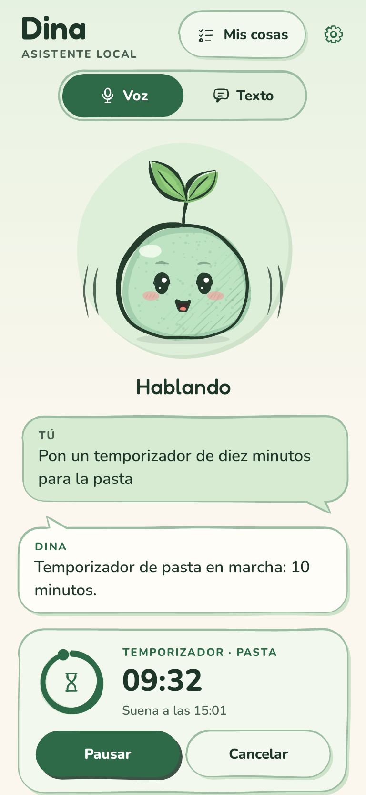
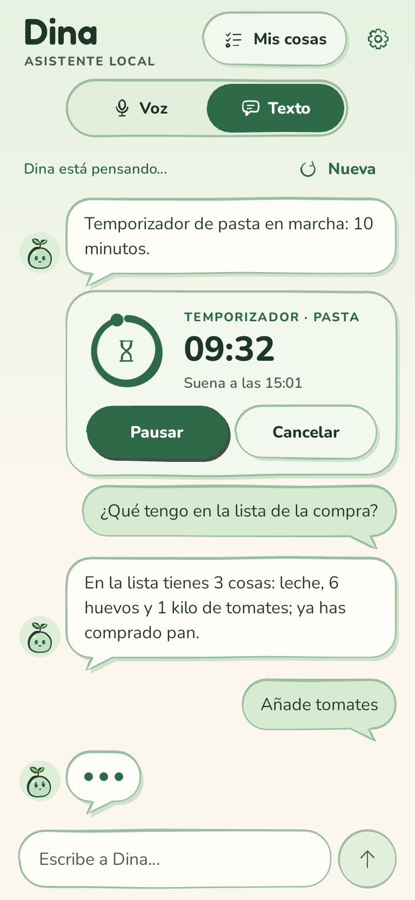
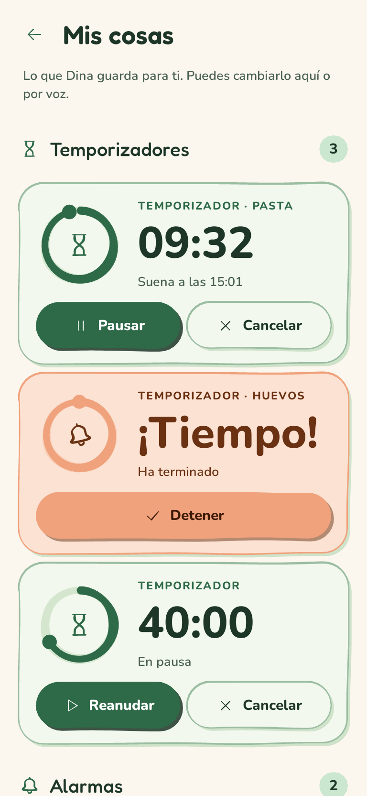
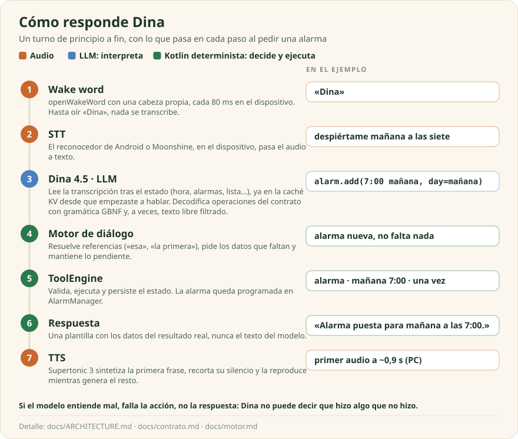
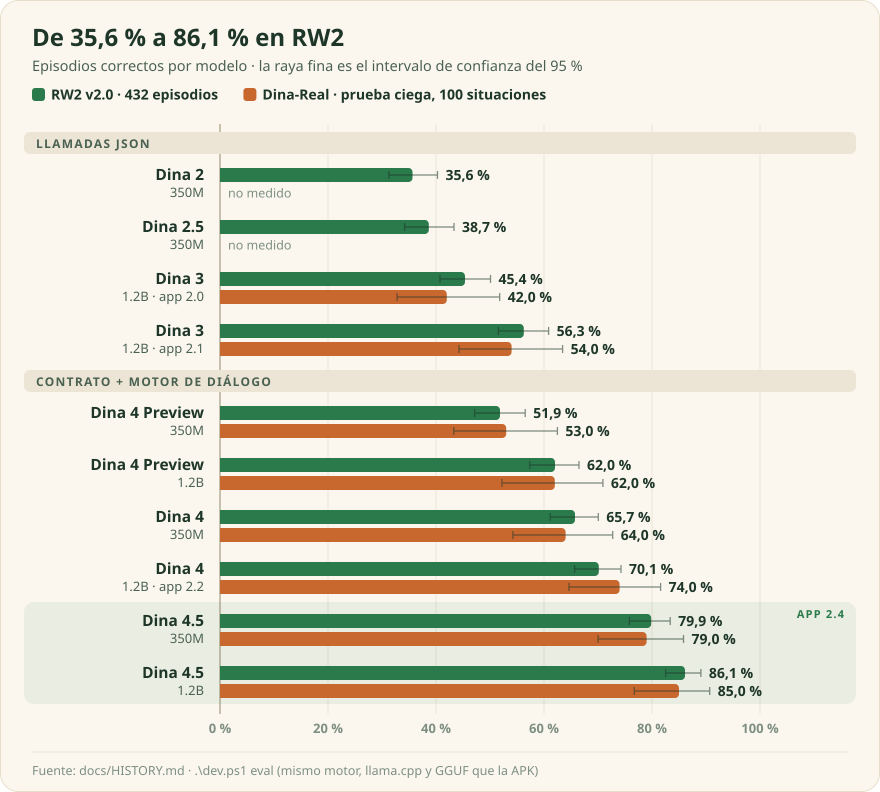
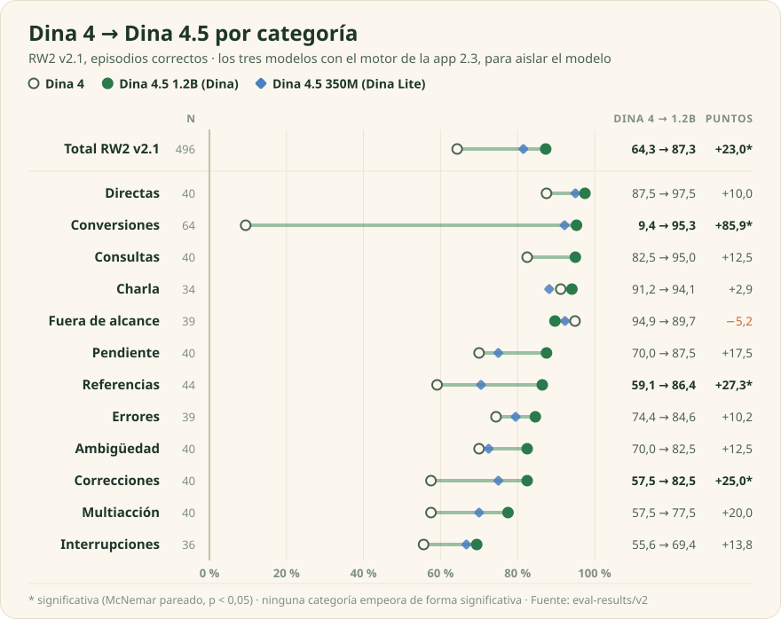
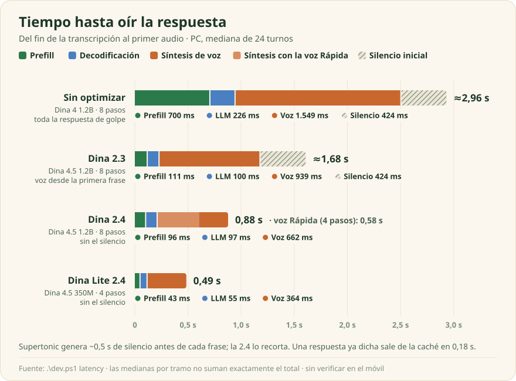
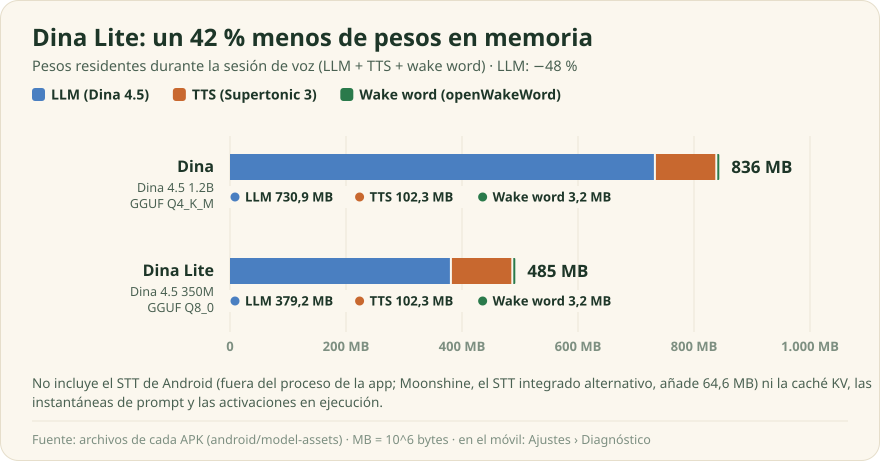

# Dina

*Offline Spanish voice assistant for Android. A LoRA fine-tune of LFM2.5 (1.2B or 350M, llama.cpp)
maps each utterance to typed actions; a deterministic Kotlin engine resolves references, executes
them and builds every spoken fact from the real result. The app has no internet permission.
Dina 4.5 scores 86.1 % on a 432-episode benchmark and 85 % on a blind test, with zero false claims.
The rest of this README is in Spanish.*

Asistente de voz en español para Android que se ejecuta íntegramente en el dispositivo: wake word,
reconocimiento de voz (STT), un LLM de 1.2B parámetros (350M en Dina Lite) que interpreta cada
frase y síntesis de voz (TTS). La app no declara el permiso de Internet. Proyecto personal,
desarrollado y probado en un Galaxy S24 Ultra.

<p align="center">
  
  
  
</p>

## Funciones

| Herramienta | Ejemplos |
|---|---|
| Alarmas | «despiértame a las siete los días laborables» · «apaga la del gimnasio» |
| Temporizadores | «diez minutos para la pasta» · «añádele dos minutos» |
| Cronómetros | «empieza a cronometrar» · «¿cuánto llevo?» |
| Lista de la compra | «apunta leche y dos docenas de huevos» · «ya tengo el pan» |
| Volumen | «baja el volumen» · «silencio» |
| Hora y fecha | «¿qué hora es en Tokio?» · «¿cuántos días faltan para Navidad?» |
| Cálculo | «¿cuánto es diecisiete por veintitrés?» |
| Conversiones | «¿cuántas millas son diez kilómetros?» · «¿cuántos gramos son dos tazas de harina?» |
| Charla | «cuéntame un chiste» · «dime una curiosidad» |

Las conversiones cubren longitud, masa, volumen, temperatura, velocidad, superficie y tiempo, más
medidas de cocina a gramos según el ingrediente. El modelo extrae cantidad y unidades; el cálculo es
determinista. El diálogo es multiturno: resuelve referencias («esa», «la primera»), acepta
correcciones, pide los datos que faltan, retoma lo pendiente y permite deshacer.

> **Tú:** Dina, pon una alarma.<br>
> **Dina:** ¿A qué hora pongo la alarma?<br>
> **Tú:** A las siete y media de la mañana.<br>
> **Dina:** Alarma puesta para mañana a las 7:30.<br>
> **Tú:** No, mejor a las ocho.<br>
> **Dina:** Alarma cambiada: suena mañana a las 8:00.<br>
> **Tú:** Pon música.<br>
> **Dina:** No puedo poner música. Sí puedo ponerte alarmas y temporizadores.

Lo que no sabe hacer (música, llamadas, mensajes, búsquedas) lo rechaza en lugar de simularlo. La
app incluye también un modo texto y una pantalla, «Mis cosas», para gestionar a mano alarmas,
temporizadores y lista.

## Arquitectura

<p align="center"></p>

El diseño separa interpretación y ejecución:

- **LLM.** Dina 4.5 (LFM2.5 de Liquid AI con LoRA, GGUF en llama.cpp) traduce la frase a
  operaciones de un contrato compacto, una por línea ([docs/contrato.md](docs/contrato.md)). La
  decodificación está restringida por una gramática GBNF generada a partir de la tabla de
  operaciones. El prompt incluye el estado visible (hora, alarmas, temporizadores, lista, turno
  anterior; unos 120 tokens), lo que permite resolver «la de las siete» o «quítale cinco minutos».
- **Motor.** Código Kotlin determinista que resuelve referencias, gestiona pendientes, deshacer y
  políticas, ejecuta sobre `ToolEngine` y genera la respuesta con plantillas a partir del resultado
  ([docs/motor.md](docs/motor.md)). El modelo no toca el estado ni redacta confirmaciones.
- **Texto libre acotado.** En charla, la respuesta la escribe el modelo; tras una acción puede añadir
  una coletilla. Un filtro rechaza horas, afirmaciones de haber hecho algo, referencias a datos del
  usuario ajenos al turno y afirmaciones de ser una persona (máx. 50 palabras en charla, 25 y sin
  números en coletillas). Chistes y curiosidades salen de bancos fijos (~300 cada uno).
- **Latencia.** El prefill del estado se hace mientras el usuario habla y se reutiliza mediante
  instantáneas de la caché KV; al final solo se procesa la transcripción. El LLM tarda ~0,29 s
  (mediana, PC).
- **TTS.** Supertonic 3 en ONNX Runtime con pesos de 8 bits, classifier-free guidance (CFG)
  separada del estimador, recorte del silencio que el modelo añade alrededor de cada frase,
  reproducción en streaming por frases y caché LRU de audio.
- **Wake word y STT.** openWakeWord con una cabeza propia para «Dina», evaluada cada 80 ms; STT en
  el dispositivo con el reconocedor de Android o Moonshine.

Detalle en [docs/ARCHITECTURE.md](docs/ARCHITECTURE.md).

## Evaluación

Todas las cifras salen de `.\dev.ps1 eval`, que ejecuta en el PC el mismo motor, la misma build de
llama.cpp y el mismo GGUF que la app.

- **Episodio.** Hora, estado inicial y uno o varios turnos. Se puntúa el estado final y la
  respuesta, no el texto del modelo; un episodio parcial cuenta como fallo.
- **RW2 (RealWorld v2).** Conjunto de desarrollo: 432 episodios en 11 categorías (órdenes,
  consultas, referencias, ambigüedad, respuestas a preguntas, correcciones, multiacción,
  interrupciones, errores, fuera de alcance, charla); 20 % en español de Latinoamérica y 123 con
  ruido de STT. v2.1 añade 64 de conversiones (496). En [benchmark/realworld_v2/](benchmark/realworld_v2/).
- **Dina-Real.** Prueba ciega para medir sobreajuste a RW2: 100 situaciones y 144 frases dictadas
  sin corregir. No se usa para ajustar nada y cada modelo se mide una sola vez. Margen de error de
  7 a 10 puntos.
- **Techo del diseño.** Con un modelo oráculo que devuelve la salida esperada, el motor obtiene el
  100 % en RW2 v2.1: los fallos restantes son del modelo.
- **Afirmaciones falsas.** Turnos en los que Dina dice haber hecho algo que no hizo.

Intervalos de Wilson al 95 % entre corchetes; comparaciones entre modelos con McNemar pareado.

## Resultados

<p align="center"></p>

Sobre el mismo LFM2.5-1.2B, la mejora viene de dos cambios: sustituir las llamadas JSON por el
contrato y el motor de diálogo (RW2 de 56 a 70) y entrenar con datos dirigidos a los fallos (de 70 a
86). Dina-Real sube en proporción (+11 puntos frente a +13,6), lo que indica que no hay sobreajuste
al conjunto de desarrollo.

| Medida | Dina 4 | **Dina 4.5 1.2B** | Dina 4.5 350M |
|---|---:|---:|---:|
| RW2 v2.0 (432) | 72,5 % [68,1–76,5] | **86,1 % [82,5–89,1]** | 79,9 % [75,8–83,4] |
| RW2 v2.1 (496) | 64,3 % [60,0–68,4] | **87,3 % [84,1–89,9]** | 81,5 % [77,8–84,6] |
| Conversiones (64) | 9,4 % [4,4–19,0] | **95,3 % [87,1–98,4]** | 92,2 % [83,0–96,6] |
| Dina-Real (100) | 74,0 % [64,6–81,6]¹ | **85,0 % [76,7–90,7]** | 79,0 % [70,0–85,8] |
| Pregunta cuando falta un dato | 78,9 % | **94,9 %** | 93,9 % |
| Cambia algo que no debía | 8,5 % | **3,0 %** | 4,0 % |
| Afirmaciones falsas | 0 / 654 turnos | **0 / 678** | 0 / 676 |

Dina 4 medido con el motor de la 2.3 para aislar el modelo. ¹ Motor de la app 2.2.

<p align="center"></p>

Mejoras significativas en conversiones, referencias y correcciones; ninguna categoría empeora de
forma significativa. Los puntos débiles son retomar tareas tras una interrupción (69 %) y la
multiacción (78 %). Fuera de alcance baja de 94,9 a 89,7 % (p = 0,63) por falta de ejemplos de
rechazo en los datos nuevos.

<p align="center"></p>

Del fin de la transcripción al primer audio, la 2.4 tarda 0,88 s frente a ~1,7 s de la 2.3, con los
mismos 8 pasos de muestreo en el TTS. Con la voz «Rápida» (4 pasos) baja a 0,58 s, Dina Lite a
0,49 s y una respuesta en caché a 0,18 s. La mejora sale del TTS: recorte del silencio que genera
Supertonic (~0,5 s antes y ~0,7 s después de cada frase), CFG separada del estimador y convoluciones
1×1 como MatMul. Son medidas en PC, con una variación de hasta el 20 % entre tandas, y **aún no se han
verificado en el móvil** (Ajustes › Diagnóstico). Detalle en
[docs/HISTORY.md](docs/HISTORY.md#app-24-voz-más-rápida-y-dina-lite).

<details>
<summary>Todos los modelos</summary>

| Modelo | Cuantización | Entrenamiento | RW2 v2.0 | Dina-Real | Latencia del modelo (p50) |
|---|---|---|---:|---:|---:|
| Dina 2 350M | Q6_K | 5.816 conversaciones | 35,6 % | – | 0,31 s |
| Dina 2.5 350M | Q6_K | 5.000 conversaciones | 38,7 % | – | 0,30 s |
| Dina 3 1.2B (app 2.0) | Q4_K_M | 6.000 conversaciones | 45,4 % | 42,0 % | 0,69 s |
| Dina 3 1.2B (app 2.1) | Q4_K_M | 6.000 conversaciones | 56,3 % | 54,0 % | 0,68 s |
| Dina 4 Preview 350M | Q8_0 | 1.275 ejemplos | 51,9 % | 53,0 % | – |
| Dina 4 Preview 1.2B | Q4_K_M | 1.275 ejemplos | 62,0 % | 62,0 % | – |
| Dina 4 350M | Q8_0 | 2.967 ejemplos | 65,7 % | 64,0 % | 0,42 s |
| Dina 4 1.2B, sin prefill anticipado | Q4_K_M | 2.967 ejemplos | 70,8 % | 74,0 % | 0,69 s |
| Dina 4 1.2B (app 2.2–2.2.2) | Q4_K_M | 2.967 ejemplos | 70,1 % | 74,0 % | 0,28 s |
| Dina 4.5 350M (Dina Lite 2.4) | Q8_0 | 7.736 ejemplos | 79,9 % | 79,0 % | 0,14 s |
| **Dina 4.5 1.2B (app 2.3 y Dina 2.4)** | Q4_K_M | 7.736 ejemplos | **86,1 %** | **85,0 %** | **0,29 s** |

Latencia: mediana por turno en PC (6 hilos), de la transcripción a las acciones. Dina 2, 2.5 y 3
generan llamadas JSON y redactan la respuesta; Dina 4 y 4.5 generan operaciones del contrato.
Historia y lecciones en [docs/HISTORY.md](docs/HISTORY.md).

</details>

## Instalación

Dos ediciones del mismo código; solo cambian el modelo y algunos valores por defecto.

<p align="center"></p>

| Edición | APK | LLM | Pesos cargados | RW2 / Dina-Real | TTS |
|---|---|---|---:|---:|---|
| **Dina** | `Dina-2.4.apk` (1,04 GB) | Dina 4.5 1.2B Q4_K_M (731 MB) | 836 MB | 86,1 % / 85 % | Natural (8 pasos) o Rápida (4) |
| **Dina Lite** | `Dina-Lite-2.4.apk` (0,68 GB) | Dina 4.5 350M Q8_0 (379 MB) | 485 MB | 79,9 % / 79 % | 4 pasos |

Requisitos: Android 14 o superior, arm64, ~2,2 GB libres (1,4 GB para Lite) entre APK y copia de
los modelos. Solo Dina se ha probado en un dispositivo (S24 Ultra); las cifras de Lite son del PC.

1. Descarga la APK de la [última versión](https://github.com/Kakauet/Dina/releases/latest).
2. Instálala permitiendo apps de esa fuente.
3. En el primer arranque copia los modelos a la memoria interna. Requiere permisos de micrófono,
   notificaciones y alarmas exactas; Ajustes indica los que falten.

**Desde la 2.3 hay que desinstalar primero**: la 2.4 usa una clave de firma nueva y Android no
permite actualizar. Se pierden alarmas, temporizadores y lista (no hay copia en la nube). Las
versiones futuras se instalarán encima.

Ambas ediciones pueden convivir (applicationId distinto, estado independiente), pero las dos
escuchan el micrófono: conviene activar solo una.

## Compilación

Requisitos:

- Windows con PowerShell 5.1 o superior; todos los comandos pasan por `dev.ps1`.
- JDK 17, Android SDK 36, NDK 27.1.12297006 y CMake 3.22.1. `dev.ps1` busca el JDK en las rutas
  habituales y el SDK en `%LOCALAPPDATA%\Android\Sdk`; si no, define `JAVA_HOME` y `ANDROID_HOME`.
- Herramientas de PC (`eval`, `latency`, `llm-bench`): [w64devkit](https://github.com/skeeto/w64devkit)
  en `C:\w64devkit` (o `W64DEVKIT`). Entrenamiento (`train`): WSL con Ubuntu 22.04, entorno conda
  `ml` (PyTorch, Transformers, PEFT) y GPU NVIDIA de 8 GB.

```powershell
git clone https://github.com/Kakauet/Dina.git
cd Dina
git submodule update --init      # llama.cpp
.\dev.ps1 test                   # tests JVM, sin modelos ni móvil -> "OK <n> tests"
```

APK de release con modelos (colocados en `models/` según [models/README.md](models/README.md)):

```powershell
.\dev.ps1 keystore               # una vez: clave de firma en %USERPROFILE%\.dina\
.\dev.ps1 apk                    # -> dist\Dina-2.4.apk y dist\Dina-Lite-2.4.apk
```

Las actualizaciones deben firmarse con la misma clave: guarda una copia de `%USERPROFILE%\.dina\`.
`DINA_SIGNING` apunta a otro `release.properties`.

Desarrollo con el móvil por USB (APK de depuración sin modelos):

```powershell
.\dev.ps1 push-models            # una vez; `push-models lite` para Dina Lite
.\dev.ps1 install                # compila e instala; `install lite`
.\dev.ps1 screenshots            # capturas de todas las pantallas (Robolectric)
```

`.\dev.ps1` sin argumentos lista todos los comandos. Las gráficas se regeneran con
`python scripts/charts/make_charts.py`.

## Modelos

No están en el repositorio; [models/README.md](models/README.md) indica el origen de cada uno. El
modelo Dina 4.5 y la cabeza del wake word se publican en la *release*; Supertonic 3, Piper, Moonshine
y openWakeWord se descargan de sus autores. **Varios tienen licencias no comerciales o con
condiciones**: ver [THIRD_PARTY.md](THIRD_PARTY.md).

## Estructura

| Carpeta | Contenido |
|---|---|
| `android/` | App (Kotlin, Jetpack Compose, llama.cpp por JNI). En `app/src/main/java/com/kakauet/dina/`: `tools/` (motor de herramientas), `dialog/` (motor de diálogo), `brain/` (Dina 4.5), `voice/`, `ui/`. Tests y evaluador en `app/src/test/`. |
| `benchmark/` | RW2 (`realworld_v2/`), RealWorld200 (histórico) y Dina-Real (ciego). |
| `scripts/` | Herramientas de PC, una carpeta por tema: `charts/` (gráficas del README), `data/` (pipeline de datos de entrenamiento), `eval/` (comparación de informes), `models/` (preparación de modelos para la APK, Piper y Moonshine), `train/` (LoRA y exportación a GGUF), `tts/` (conversión de Supertonic y bancos de prueba) y `wakeword/` (entrenamiento y evaluación del wake word). |
| `docs/` | Arquitectura, contrato, motor, datos, entrenamiento, historia y hoja de ruta. |
| `models/`, `data/` | Pesos y datos locales (fuera de Git). |

[AGENTS.md](AGENTS.md) es la guía para agentes de código (Claude Code, Codex).

## Estado

Versión 2.4 (octubre de 2026). Pendiente: interrupciones, multiacción, números en palabras y
peticiones imposibles parecidas a las posibles; ver [docs/ROADMAP.md](docs/ROADMAP.md).

## Licencia

Código propio bajo [MIT](LICENSE), © 2026 Kakauet. Los modelos y bibliotecas de terceros mantienen
sus licencias ([THIRD_PARTY.md](THIRD_PARTY.md)).
